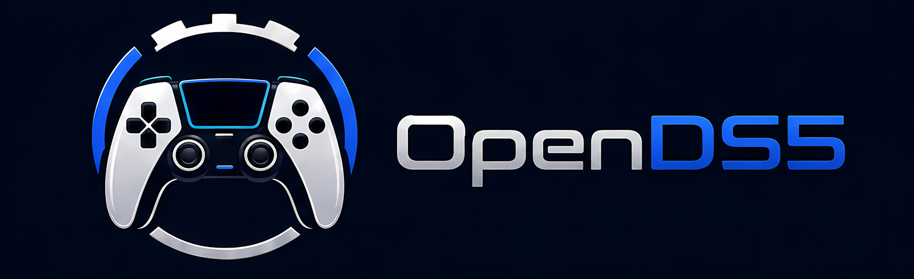

<p align="center">
  
</p>

Bring the **OpenDS5** feature set (audio, haptics, Trigger Lab, lighting,
button remapping, personas, chords) to **Linux** — with no Pico 2 W hardware —
by using **vds** (virtual DualSense) as the transport layer instead of the
Pico dongle.

## How the pieces fit

```
DualSense (Bluetooth)
   │
   ▼
vds_hcd.ko (kernel module) + vdsd (daemon)     ← from hurryman2212/vds
   │  exposes the controller as a virtual USB DualSense
   ▼
Companion app (Electron, ported to Linux)      ← from SundayMoments/DS5_Bridge
      talks to vdsd instead of the Pico's WinUSB companion interface
```

## Repo layout

| Path | Origin | License | Purpose |
| --- | --- | --- | --- |
| `vds/` | [hurryman2212/vds](https://github.com/hurryman2212/vds) @ `1448bb8` | MIT | Kernel module, `vdsd` daemon, `vdsctl` — the Linux transport. |
| `ds5-bridge/companion/` | [SundayMoments/DS5_Bridge](https://github.com/SundayMoments/DS5_Bridge) @ `a8ec87d` | AGPL-3.0-only | Electron companion app to be ported to Linux. |
| `ds5-bridge/docs/` | DS5_Bridge | AGPL-3.0-only | Upstream development docs. |
| `docs/PORTING.md` | this repo | — | Port plan and Windows-dependency inventory. |

The Pico 2 W firmware, board files, and Windows installer tooling from
DS5_Bridge were intentionally **not** imported — the vds transport replaces
that hardware path.

## System setup

Just run the AppImage. On first launch a **setup wizard** detects your distro,
shows exactly what it will install, and — after a single password prompt —
installs the `vds_hcd` kernel module (DKMS, headers, Secure Boot signing) and
the `vdsd` userspace stack (daemon, systemd service, udev rules). Supported:
Fedora, Arch/CachyOS, Debian/Ubuntu, openSUSE, Bazzite/Silverblue, and NixOS
(declarative snippet).

Prefer the terminal? `./OpenDS5.AppImage --install-system` does the same thing.
See [docs/INSTALLER.md](docs/INSTALLER.md) for the per-platform details, exit
codes, and log locations.

## Trigger Profiles

Adaptive trigger profiles let the companion app automatically apply
per-game DualSense trigger effects (weapon/vibration modes, start/wall/force
percentages) for games that have no native DualSense support — the app
detects the running process, matches it to a saved profile, and pushes the
effect to the controller through the same bridge transport used for the rest
of OpenDS5's features.

- **Where profiles live:** `<userData>/trigger-profiles/*.json` (one file
  per profile; see `TriggerProfileStore` in
  `ds5-bridge/companion/src/main/trigger-profile-store.ts`).
- **evdev permission note:** reactive modifiers (e.g. "full pull" vibration)
  read live trigger input from the virtual DualSense's `/dev/input/event*`
  node, which requires read access to that device — typically membership in
  the `input` group. Without that access, static base effects (the profile's
  default weapon/vibration curve) still apply; reactive modifiers do not.
### Effect modes (M2)

The effect editor exposes the full DualSense adaptive-trigger surface. A base
effect and each reactive modifier can use any of these modes:

| Mode | Fields | Feel |
| --- | --- | --- |
| `off` | — | Trigger goes fully limp; no resistance. |
| `feedback` | `startPercent`, `forcePercent` | Constant wall of resistance from the start point onward. |
| `weapon` | `startPercent`, `wallPercent`, `forcePercent` | Resistance that builds to a hard wall, then releases past it — like a gun trigger's break. |
| `vibration` | `startPercent`, `forcePercent`, `frequencyHz` (optional) | Buzzing/rumbling resistance past the start point. |
| `multi-feedback` | `zones` (10 values, 0–100) | Independent resistance strength across 10 positions along the pull — a custom resistance curve. |
| `slope` | `startPercent`, `endPercent`, `startForcePercent`, `endForcePercent` | A resistance ramp that rises (or falls) linearly between two points. |
| `multi-vibration` | `frequencyHz`, `zones` (10 values, 0–100) | Per-zone vibration amplitude across the pull at a shared frequency. |

`off`, `multi-feedback`, `slope`, `multi-vibration`, and `vibration` with an
explicit `frequencyHz` use the V2 trigger command; the other modes use the
classic V1 command.

### Import / export & the profile library

- **Import / Export buttons** in the Trigger Profiles UI read and write profile
  JSON files. Import always creates a *fresh copy*: the profile is re-validated,
  given a new id and a collision-free display name, and stamped with
  `meta.source` recording where it came from (`import` or `library`).
- **Profile library:** per-game profiles live in their own public repo,
  [OpenDS5-Profiles](https://github.com/LordVicky/OpenDS5-Profiles), which the
  in-app library browser fetches at runtime — so new game support ships without
  an app release. To add a game, export the profile from the app and open a PR
  there; its contributor guide has the details. Profiles install as fresh copies.
- **Validator:** the profiles repo vendors this repo's `trigger-profiles.ts`,
  `profile-capabilities.ts`, and `protocol.ts` under `validator/`, so its CI
  gates contributions on exactly the rules the app enforces at install time.
  `node scripts/sync-validator.mjs` republishes them after a schema change;
  `--check` runs in CI and fails if the published copy has drifted.

### Full-surface modes need a current vdsd

The full-surface modes (`multi-feedback`, `slope`, `multi-vibration`, and V2
`vibration` with a frequency) depend on the V2 trigger command in the virtual
DualSense daemon. If those effects do nothing on your controller, your `vdsd`
is likely stale — update it with `./update-vdsd.sh` and retry.

## License

The combined work is **AGPL-3.0-only** (required by the DS5_Bridge-derived
code). Files under `vds/` retain their upstream MIT license. See
`ds5-bridge/LICENSE`, `ds5-bridge/NOTICE`, and `vds/LICENSE`.
